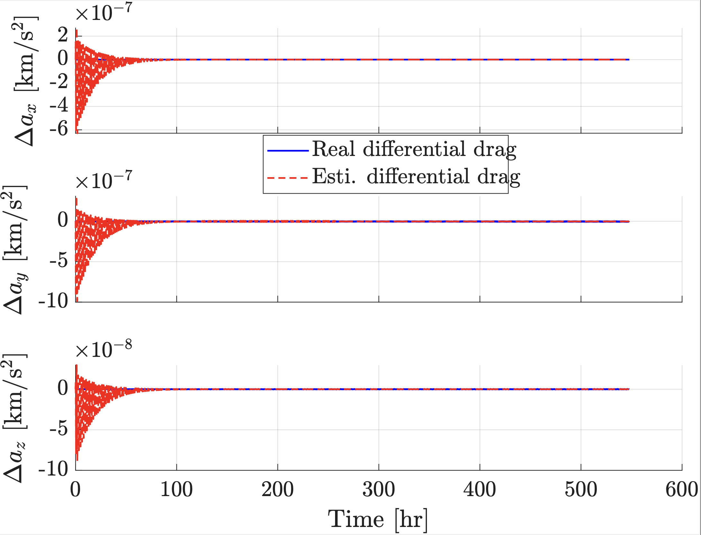
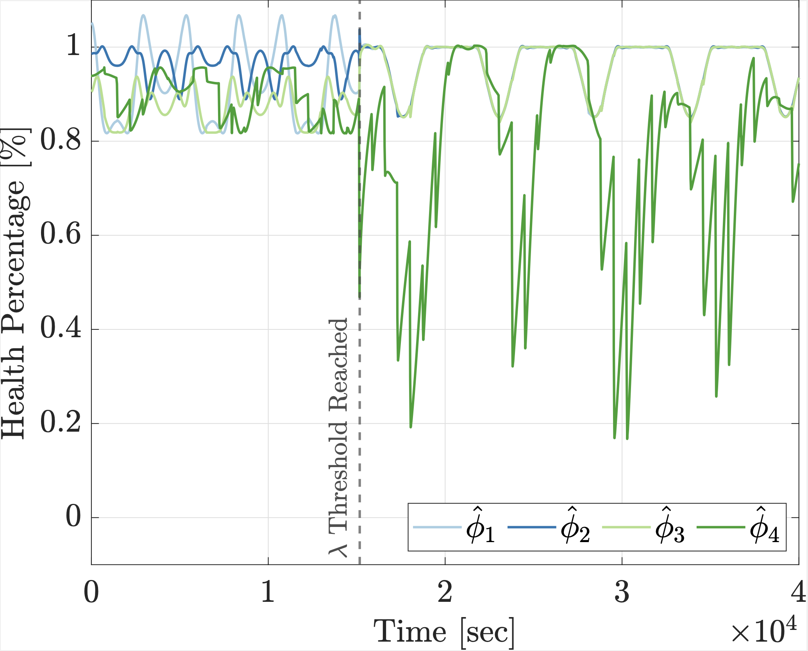
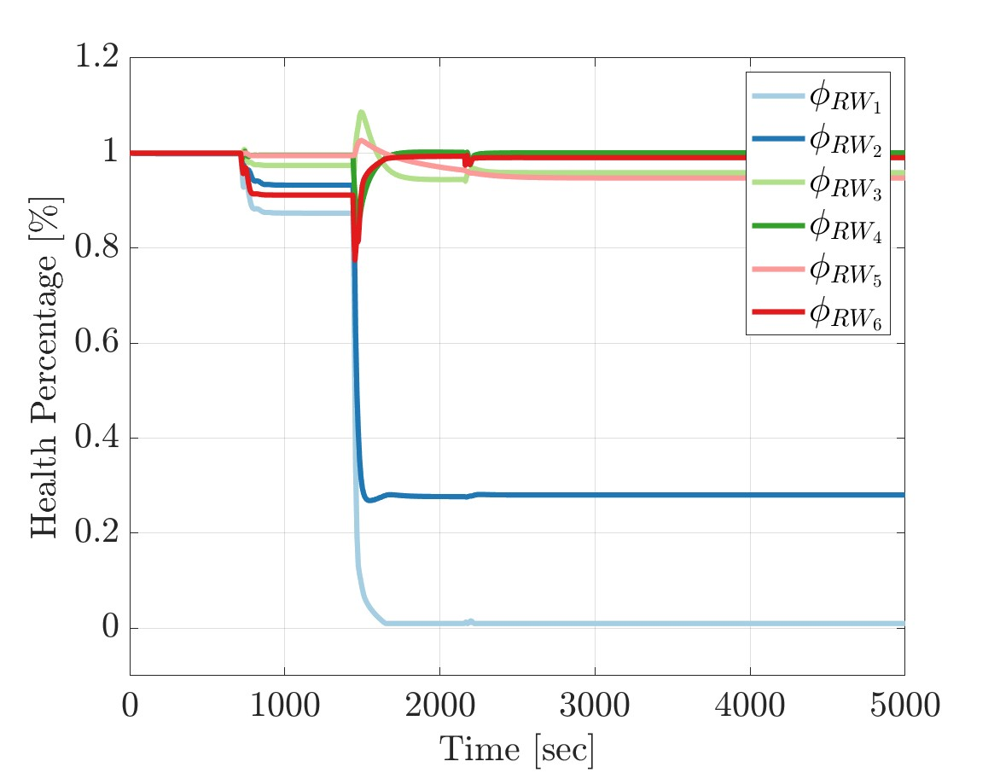
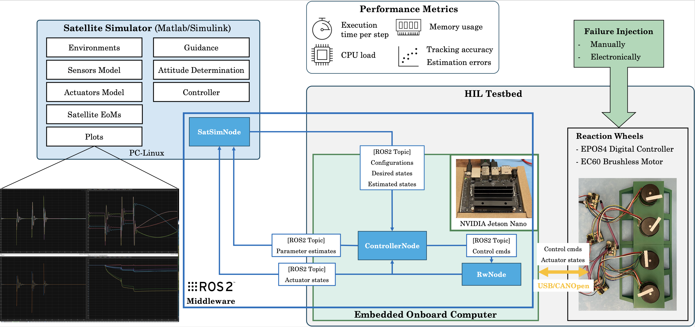

---
hide:
  - toc
---

# Morokot Sakal

I’m a PhD student in Aerospace Engineering at [Florida Tech](https://www.fit.edu/), supervised by [Camilo A. Riano-Rios](https://www.fit.edu/faculty-profiles/r/riano-rios-camilo/) in the [Space Vehicles and Robotics (SVR) Lab](https://www.camilori.com/svr-lab/). I work on guidance, navigation, and control (GNC), adaptive/learning controllers, and hardware-in-the-loop (HIL) testbeds for small spacecraft.

Previously, I earned my M.Eng. in Aerospace Engineering from [Tohoku University](https://www.tohoku.ac.jp/en/), where I worked with [Dr. -Ing. Toshinori Kuwahara](https://www.space-infrastructure.gxt.ggi.tohoku.ac.jp/members/toshinori-kuwahara) in the [Space Infrastructure Engineering Laboratory](https://www.space-infrastructure.gxt.ggi.tohoku.ac.jp/en/), formerly part of the [Space Robotics Laboratory](https://astro2.mech.tohoku.ac.jp/en/). I contributed to the development and testing of the 50 kg-class microsatellite [RISESAT](https://www.space-infrastructure.gxt.ggi.tohoku.ac.jp/project/risesat) and the 3U CubeSat [IHI-SAT](https://www.ihi.co.jp/en/all_news/2021/aeroengine_space_defense/1197719_3366.html), including plug-and-play payload integration and fault detection and recovery software to support mission operations.

I worked with [Dr. Maximilien Berthet](https://www.maximilienberthet.com/) on the 1U CubeSat [Apsara-1](http://dclab.itc.edu.kh/ut-itc-cube-satellite-project) project in Phnom Penh, Cambodia (Dec 2020 – Jul 2021), a collaboration between the [Dynamics and Control Laboratory](http://dclab.itc.edu.kh/) at [Institute of Technology of Cambodia](https://itc.edu.kh/) and [University of Tokyo](https://www.u-tokyo.ac.jp/en/). We submitted the design specification to the 6th-round [KiboCUBE](https://www.unoosa.org/oosa/en/ourwork/access2space4all/KiboCUBE/KiboCUBE_Index.html) call.

I enjoy mentoring student teams in robotics competitions, including the [World Robotics Olympiad](https://sites.google.com/view/aupphsrobotics/wro?authuser=0) and Cambodia Robotics Competition, as well as space competitions such as the [International Space Challenge](https://spacefaculty.asia/isc/).

<!-- [Email](mailto:morokot@example.com) / -->
[Google Scholar](https://scholar.google.com/citations?user=43ccP74AAAAJ&hl=en) /  [LinkedIn](https://www.linkedin.com/in/morokot-sakal/) / [GitHub](https://github.com/msakal-fit) / [YouTube](https://www.youtube.com/@msakal2024)

  

---

## Research

  
  

### Real-Time Estimation of Drag-Based Parameters in LEO via Adaptive Control and Sparse Identification
<!--Real-time estimation of drag-based parameters in LEO using adaptive control with sparse identification ideas. -->
**Morokot Sakal**, Camilo Riano-Rios, Madhur Tiwari  
*AIAA SciTech Forum*, 2026  
[DOI](https://arc.aiaa.org/doi/abs/10.2514/6.2026-2625) / [PDF](https://www.camilori.com/files/2026-aiaa-scitech-1.pdf) / [Video](https://youtu.be/Iv0AO12XWS0)

  

  
  

### Radial Basis Function Neural Network–Based Adaptive Attitude Control with Reaction–Wheel Health Estimation
<!--RBFNN-based adaptive attitude control with integrated reaction-wheel health estimation. -->
**Morokot Sakal**, George M. Nehma, Camilo Riano-Rios, Madhur Tiwari  
*Journal of Guidance, Control, and Dynamics* (Under Review); *AAS/AIAA Astrodynamics Specialist Conference*, 2025, AAS 25-682: [PDF](https://www.camilori.com/files/2025-aiaa-asc-1.pdf) / [Video](https://youtu.be/a6q9D74rS3w).

  

  
  

### Adaptive Controller for Simultaneous Spacecraft Attitude Tracking and Reaction Wheel Fault Detection
<!--Adaptive control for attitude tracking with simultaneous reaction wheel fault detection.  -->
George M. Nehma, Camilo Riano-Rios, **Morokot Sakal**, Madhur Tiwari  
*Journal of Spacecraft and Rockets* (Accepted), 2026.
[Paper](https://www.camilori.com/files/2026-aiaa-jsc-1.pdf)

  

  
  

### Real-Time Testing of Satellite Attitude Control with A Reaction Wheel Hardware-In-the-Loop Platform
<!--Real-time testing of satellite attitude control using a reaction wheel hardware-in-the-loop platform.  -->
**Morokot Sakal**, George Nehma, Camilo Riano-Rios, Madhur Tiwari  
*AAS/AIAA Astrodynamics Specialist Conference*, 2025.
AAS 25-778: [PDF](https://www.camilori.com/files/2025-aiaa-asc-2.pdf) / [Video](https://youtu.be/XByTKIB5-vI)

  

  <!-- end .projects -->

